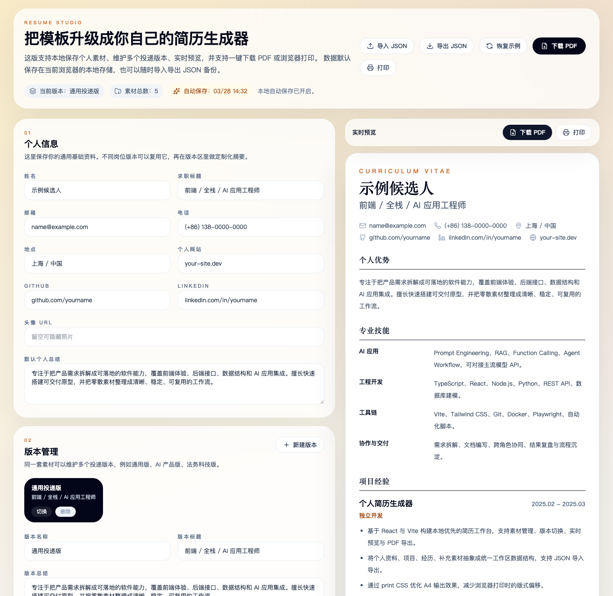

# Personal Resume Studio

A local-first resume generator for personal use. It lets you save profile data and reusable resume materials, maintain multiple application variants, preview the result in real time, and export PDF via the browser print flow.



## Features

- Local-first workspace stored in the browser
- Multiple resume variants based on one shared material library
- Real-time preview with print-optimized layout
- JSON import/export for backup and migration
- One-click PDF download
- Browser print export as a fallback
- GitHub Actions CI for type-check and build verification

## Privacy

- No backend, no account system, no analytics, no API key requirement
- Resume data is stored in browser `localStorage`
- Data leaves your machine only when you explicitly export JSON, open external links, or provide a remote avatar URL yourself
- The default project no longer loads remote fonts or remote avatar images

## Quick Start

### Requirements

- Node.js 20+

### Run locally

```bash
npm install
npm run dev
```

Then open `http://localhost:3000`.

### Production build

```bash
npm run build
npm run preview
```

## Project Structure

- `src/App.tsx`: editor UI, preview, import/export, version management
- `src/resume-data.ts`: workspace schema, default data, normalization helpers
- `src/index.css`: visual theme and print styles

## Open Source Workflow

- CI runs `npm ci`, `npm run lint`, and `npm run build` on pushes and pull requests
- Issue templates are included for bugs and feature requests
- A pull request template is included to keep contributions reviewable

## Notes

- This project is inspired by tools like JSON Resume, Reactive Resume, OpenResume, and RenderCV, but is intentionally much smaller and optimized for single-user local usage.
- The default PDF download is client-side and does not require a backend service.
- Browser print remains available as a fallback when you want to use the system print dialog.

## License

MIT
